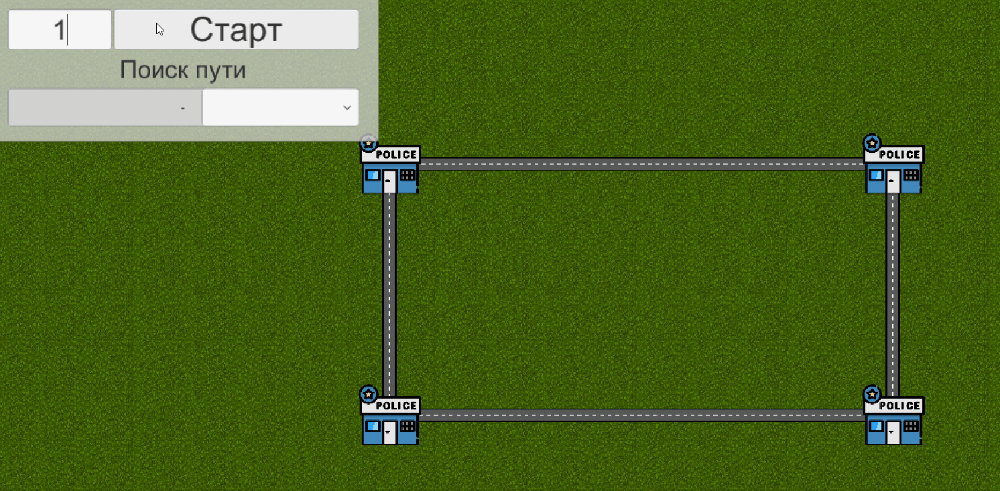
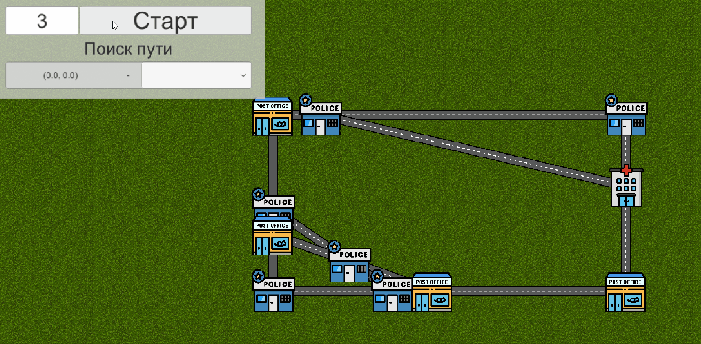

# Тестовое задание - генерация города в виде графа
## Что это такое
В качестве тестового задания необходимо было написать генерацию города в виде графа, где на пересечении всех дорог(то есть, ребер графа) нужно было построить городские объекты (вершины графа), а затем найти кратчайший путь от выбранного пользователем объекта до ближайшего пункта заданного типа.

[Полный текст задания](https://docs.google.com/document/d/1wUUHNVo_gxsN4MZ6SZNxI4OVX0oDgoDlyjBMNhHJoas/edit#heading=h.8ne7hh5px4gb) (доступ только по ссылке) 

### Примеры

ekostenkodev@gmail.com